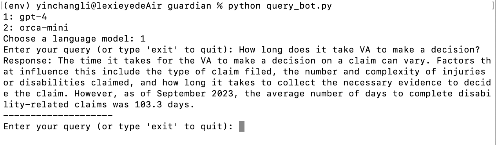
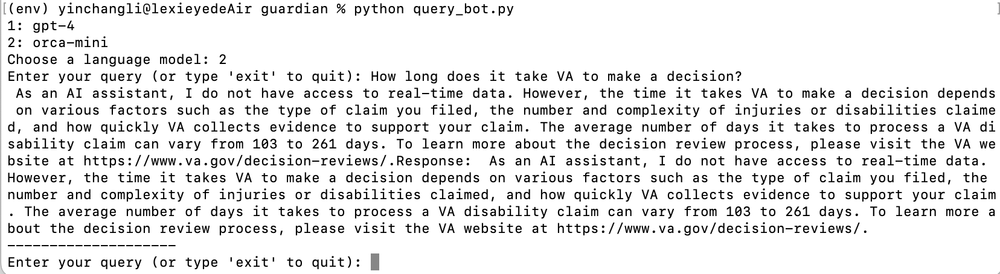

# Conversational knowledge retrieval system on VA disability compensation

## Summary
The repository demostrates how to use GPT-4, Open-source model Orca Mini, vector database and LangChain to build a knowledge retrieval conversational system for information in VA disability compensation website. 

Experiments were conducted using differnet vector database and retriever methods including Elasticsearch, Chrom, FAISS, Self-quering, and ensembeble method. 

NeMo Guardrail is tested to ensure the quality of the responses. 

Batch evaluation is run on 10 questions with ground truths (created manually) for the RAG framework. The average scores are following: 

- answer correctness: 82%
- answer relevancy: 89%
- context precision: 94%
- context recall: 85%

Finally, a query chatbot is built which allow user to interact with in Terminal. User can select either GPT4 or open-source Orca Mini model. 

## Prerequisites

Download and run Elasticsearch on local machine
```
docker run -p 9200:9200 -e "discovery.type=single-node" -e "xpack.security.enabled=false" -e "xpack.security.http.ssl.enabled=false" docker.elastic.co/elasticsearch/elasticsearch:8.9.0
```
After Elasticsearch is running, run Experiments/knowledge_retrieval_experiment.ipynb to ingest the data.

For using open-source LLM, install Ollama from: https://github.com/jmorganca/ollama

## Using query chatbot in your terminal

1. Install required packages
```bash
pip install -r requirements.txt
```

2. run query_bot.py 
```bash
python query_bot.py 
```

## Sample Output
### Output from GPT4, Openai embedding, and ElasticSearch



### Output from Orca Mini, e5 embedding, and ElasticSearch




